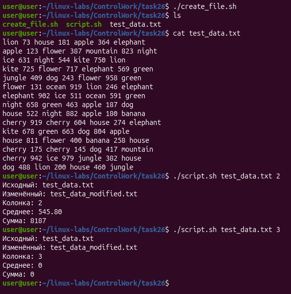

### Обработка текстового файла (Bash)

Скрипт для генерации тестового файла и последующей обработки: замена слов на 0, вычисление суммы и среднего арифметического чисел в указанной колонке.

### Файлы

- create_test_file.sh — генерация файла test_data.txt (15 строк, 7 полей: слово/число)
- process.sh — основной скрипт обработки

